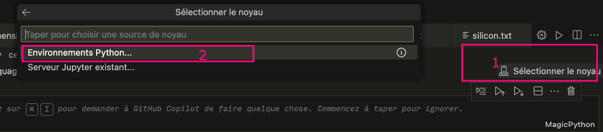

# ⚙️ Configuration de Linux pour la masterclass Data

Ce document présente les étapes essentielles pour configurer un environnement Linux avec **Python**, **pyenv**, **TensorFlow**, **pandas**, **VSCode**, et **Jupyter**.

---

## 1. 🛠️ Installation des outils de base

### Git, curl, et autres outils
Installez les outils de base nécessaires via votre terminal :
```bash
sudo apt update
sudo apt install -y curl git imagemagick jq unzip vim zsh tree
```

---

## 2. 🐍 Installation de Python et pyenv

### Installation de pyenv

1. Clonez le dépôt `pyenv` dans votre dossier personnel :
```bash
git clone https://github.com/pyenv/pyenv.git ~/.pyenv
```

2. Installez les dépendances nécessaires à la compilation de Python :
```bash
sudo apt-get install -y make build-essential libssl-dev zlib1g-dev libbz2-dev libreadline-dev libsqlite3-dev wget curl llvm libncursesw5-dev xz-utils tk-dev libxml2-dev libxmlsec1-dev libffi-dev liblzma-dev python3-dev
```

3. Configurez votre environnement en ajoutant les lignes suivantes à votre fichier `.bashrc` ou `.zshrc` :
```bash
export PATH="$HOME/.pyenv/bin:$PATH"
eval "$(pyenv init --path)"
eval "$(pyenv init -)"
```

4. Rechargez votre terminal pour que les changements prennent effet :
```bash
source ~/.bashrc
```

---

## 3. 📦 Installation des packages Python (TensorFlow, pandas, etc.)

### Création d'un environnement virtuel

1. Installez le plugin `pyenv-virtualenv` :
```bash
git clone https://github.com/pyenv/pyenv-virtualenv.git $(pyenv root)/plugins/pyenv-virtualenv
```

2. Créez et activez un environnement virtuel :
```bash
pyenv install 3.12.3  # Remplacez par la version souhaitée de Python
pyenv virtualenv 3.12.3 masterclassData
pyenv activate masterclassData
```

3. Installez les packages Python nécessaires :
```bash
pip install -r intel.txt
```

---

## 4. 🖥️ Installation de Visual Studio Code (VSCode)


1. Installez Visual Studio Code en exécutant les commandes suivantes :
```bash
wget -qO- https://packages.microsoft.com/keys/microsoft.asc | gpg --dearmor > packages.microsoft.gpg
sudo install -o root -g root -m 644 packages.microsoft.gpg /etc/apt/trusted.gpg.d/
sudo sh -c 'echo "deb [arch=amd64,arm64,armhf signed-by=/etc/apt/trusted.gpg.d/packages.microsoft.gpg] https://packages.microsoft.com/repos/code stable main" > /etc/apt/sources.list.d/vscode.list'
rm -f packages.microsoft.gpg
sudo apt update
sudo apt install -y code
```

2. Lancez VSCode avec la commande :
```bash
code
```

Good Job 👌🏼 Ta machine est prête maintenant pour commencer. Tu peux dès a présent dans vsCode créer un fichier .**ipynb** et choisir le bon kernel afin de te familiariser avec Jupyter.

## 7. 🫀 📓 Configurer le noyau Jupyter Notebook dans VS Code

Dans vsCode, tu vas devoir selectionner le Kernel que tu souhaites sutiliser. C'est à dire l'environnement de python avec lequel ton notebook doit lancer ses cellules.



Comme sur l'image précedente, tu dois cliquer sur :
   1. Selectionner un noyau
   2. Environnements Python
   3. Et enfin choisir l'environnements que tu as créé avec Pyenv

## 8. 📚 Des ressources à préparer

- [Utilisation de Jupyter](https://www.youtube.com/watch?v=g2yckh3_22E)
- [Les bases de Python](https://courspython.com/introduction-python.html)
- [Choisir le Kernel de VsCode](https://medium.com/@ranggakd/set-up-your-jupyter-notebook-kernel-in-vs-code-with-pyenv-virtualenv-in-wsl-1266723723ef)
