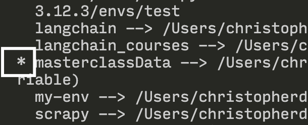

# ⚙️ Configuration de macOs pour la masterclass Data

Cette fiche présente les étapes essentielles pour configurer un Mac avec **Python**, **pyenv**, **TensorFlow**, **pandas**, **Homebrew**, et **Jupyter**.

---

## 🍺 Installation de Homebrew

Homebrew esHomebrew est un gestionnaire de paquets pour macOS, nécessaire pour installer plusieurs outils.

- Ouvrir le terminal et exécuter :

``` bash
/bin/bash -c "$(curl -fsSL https://raw.githubusercontent.com/Homebrew/install/HEAD/install.sh)"
```
- Mettre à jour Brew:

``` bash
brew update
```

Par la suite installer les package suivants:
```bash
brew upgrade git         || brew install git
brew upgrade jq          || brew install jq
brew upgrade openssl     || brew install openssl
brew upgrade xz          || brew install xz
brew upgrade zlib        || brew install zlib
brew upgrade readline    || brew install readline
```

Attention ⚠️

Il est possible que vous ayez une erreure de la sorte :

``` bash
Error: Not a valid ref: refs/remotes/origin/master :
fatal: ambiguous argument 'refs/remotes/origin/master': unknown revision or path not in the working tree.
```

Si c'est le cas cette ligne de commande doit régler le problème:
```bash
rm -fr $(brew --repo homebrew/core)  # because you can't `brew untap homebrew/core`
brew tap homebrew/core
```

[Solution Github](https://github.com/Homebrew/brew/issues/10368)

## ⚙️ Installer les outils en ligne de commande

Xcode CLI tools sont essentiels pour faire fonctionner plusieurs outils.

Installe-les avec cette commande magique 🧙‍♂️ :

```bash
xcode-select --install
```
## 🐍 Installation de python
###  Comment vérifier si Python est déjà installé sur votre Mac

Si votre macOS est plus ancien que Catalina, il se peut que Python soit déjà installé. Voici comment le vérifier :

1. Allez dans **Applications** > **Utilitaires** > **Terminal**.
2. Tapez : `python --version`
3. Appuyez sur **Entrée** ⏎
4. Si Python est installé, un message indiquera la version installée.
5. Si Python n'est pas installé, vous verrez le message : `command not found: python`


### Comment installer Python dans le cas ou il n'est pas installé

Pour installer Python sur votre Mac, vous devrez d'abord télécharger l'installateur officiel.

1. Ouvrez un navigateur web et allez sur : [python.org/downloads](https://www.python.org/downloads/)
2. Vous serez automatiquement dirigé vers la page de téléchargement. Cliquez sur **Télécharger la dernière version pour macOS**.
3. Une fois le téléchargement terminé, ouvrez le fichier d'installation pour le lancer.
4. Cliquez sur **Continuer** et suivez les instructions à l'écran.
5. Une fois l'installation terminée, un dossier Python apparaîtra dans votre dossier **Applications**.


### ✅ Pour vous assurer que l'installation s'est bien déroulée…

1. Ouvrez le dossier **Python** dans vos applications et double-cliquez sur **IDLE** pour vérifier que tout est installé correctement.
2. Quand IDLE s'ouvre, une interface en ligne de commande apparaîtra. Tapez la commande suivante pour tester le bon fonctionnement :
```python
   print('Hello world')
```
## 📦 Installation de pyenv pour un environnement virtuel

### Installer Pyenv

Pyenv te permet de jongler avec différentes versions de Python, et donc de créer plusieurs environnements sécuriser qui n'auront pas d'impact les uns sur les autres.

Installe Pyenv via Homebrew :

 ```bash
brew install pyenv
```


Configure ton terminal pour qu’il utilise Pyenv automatiquement:

- Pour zshrc:

``` bash
echo 'export PYENV_ROOT="$HOME/.pyenv"' >> ~/.zshrc
echo 'export PATH="$PYENV_ROOT/bin:$PATH"' >> ~/.zshrc
echo 'eval "$(pyenv init --path)"' >> ~/.zshrc
exec zsh
```

- Pour bash:
``` bash

echo 'export PYENV_ROOT="$HOME/.pyenv"' >> ~/.bashrc
echo 'export PATH="$PYENV_ROOT/bin:$PATH"' >> ~/.bashrc
echo 'eval "$(pyenv init --path)"' >> ~/.bashrc
source ~/.bashrc
```


### Installer la bonne version de Python avec Pyenv

Maintenant nous allons créer notre environnement de travail.

Avec pyenv tu peux maintenant lister l'ensemble des versions disponibles au telechargements :

```bash
pyenv install --list
```

Pour notre cours nous allons utiliser la versions 3.12.3

``` bash
pyenv install 3.12.3
```

POur être sûr que tu peux continuer, vérifie que ton installation c'est bien passé:
- Lance la commande
```bash
pyenv versions
```


Si tu vois bien la version dans la reponse du terminal tu peux continuer.

### 🌍 Créer un environnement virtuel

On va créer maintenant un environnement virtuel à partir de cette version de python.

Installe le plugin pyenv-virtualenv :

``` bash
brew install pyenv-virtualenv
source ~/.zshrc (si zsh)
source ~/.bashrc (si bash)
```
Créer ton premier environnement virtuel 🔮 :

``` bash
pyenv virtualenv 3.12.3 masterclassData
pyenv activate masterclassData
```


## 📦 Installer les packages essentiels

Une dérnière étape à suivre.
Maintenant vous allez devoir installer l'ensemble des paquets python nécessaires avec votre nouvel environnement virtuel fraichement installé.
Pour ce faire rien de plus simple:
- Vérifiez bien que vous êtes dans votre environnement virtuel :
   
-  Par la suite si vous êtes sur un apple silicon:
```bash
pip install -r  silicon.txt
```
- Dans le cas ou vous êtes sur intel
```bash
pip install -r intel.txt
```

Good Job 👌🏼 Ta machine est prête maintenant pour commencer. Tu peux dès a présent dans vsCode créer un fichier .**ipynb** et choisir le bon kernel afin de te familiariser avec Jupyter.

## 🫀 📓 Configurer le noyau Jupyter Notebook dans VS Code

Dans vsCode, tu vas devoir selectionner le Kernel que tu souhaites sutiliser. C'est à dire l'environnement de python avec lequel ton notebook doit lancer ses cellules.


Comme sur l'image précedente, tu dois cliquer sur :
   1. Selectionner un noyau
   2. Environnements Python
   3. Et enfin choisir l'environnements que tu as créé avec Pyenv

## 📚 Des ressources à préparer

- [Utilisation de Jupyter](https://www.youtube.com/watch?v=g2yckh3_22E)
- [Les bases de Python](https://courspython.com/introduction-python.html)
- [Choisir le Kernel de VsCode](https://medium.com/@ranggakd/set-up-your-jupyter-notebook-kernel-in-vs-code-with-pyenv-virtualenv-in-wsl-1266723723ef)
